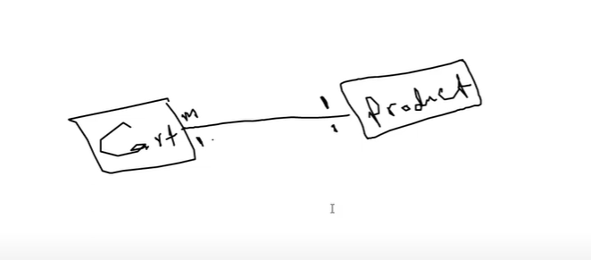

## ⚡ 1-  Types of relationships in a database:
### 1- One-to-One:
- مثال: كل User له Profile واحد فقط.
```php
// users table
Schema::create('users', function (Blueprint $table) {
    $table->id();
    $table->string('name');
    $table->timestamps();
});

// profiles table
Schema::create('profiles', function (Blueprint $table) {
    $table->id();
    $table->foreignId('user_id')->constrained()->onDelete('cascade');
    $table->string('bio')->nullable();
    $table->timestamps();
});

---------------------------------------

// In user.php
public function profile()
{
    return $this->hasOne(Profile::class);
}

// In profile.php
public function user()
{
    return $this->belongsTo(User::class);
}

```
### 2- One-to-Many:
- مثال: User يكتب Posts كثيرة.
```php
// users table
Schema::create('users', function (Blueprint $table) {
    $table->id();
    $table->string('name');
    $table->timestamps();
});

// posts table
Schema::create('posts', function (Blueprint $table) {
    $table->id();
    $table->string('title');
    $table->text('content');
    $table->foreignId('user_id')->constrained()->onDelete('cascade');
    $table->timestamps();
});

---------------------------------------

// In user.php
public function posts()
{
    return $this->hasMany(Post::class);
}

// In profile.php
public function user()
{
    return $this->belongsTo(User::class);
}
```
### 3- Many-to-Many:
- مثال: Students يدرسون في Courses، وكل Course له طلاب كُثر.
  
```php
// students table
Schema::create('students', function (Blueprint $table) {
    $table->id();
    $table->string('name');
    $table->timestamps();
});

// courses table
Schema::create('courses', function (Blueprint $table) {
    $table->id();
    $table->string('title');
    $table->timestamps();
});

// pivot table
Schema::create('course_student', function (Blueprint $table) {
    $table->id();
    $table->foreignId('student_id')->constrained()->onDelete('cascade');
    $table->foreignId('course_id')->constrained()->onDelete('cascade');
});

---------------------------------------

// In Student.php
public function courses()
{
    return $this->belongsToMany(Course::class);
}

// In Course.php
public function students()
{
    return $this->belongsToMany(Student::class);
}
```


## ⚡ 2-  if i have (cart & product):



- cart need product
- cart has forign key(product_id)
- one product can be found in many cart (one to many) 
- cart has one product (one to one)
- we take big relation (one to many)
#### 1- كل Cart فيه منتج واحد بس → من جهة Cart = belongsTo(Product).
#### 2- نفس المنتج ممكن يكون موجود في أكتر من Cart → من جهة Product = hasMany(Cart).

- إذن في Laravel Models:
```
in Cart.php:
public function product()
{
    return $this->belongsTo(Product::class);
}
```
```
in Product.php:
public function carts()
{
    return $this->hasMany(Cart::class);
}
```
- ال belongsTo يتحط في الـ Model اللي بيحتوي على الـ foreign key.
- ال hasMany يتحط في الـ Model اللي بيتم الإشارة ليه بالـ foreign key.

## ⚡ 3-  Eager Loading
- في Laravel معناها إنك تجيب البيانات الأساسية مع البيانات المرتبطة بيها في نفس الاستعلام بدل ما تعمل استعلام لكل علاقة لوحدها.
- لأن في العادة، لو عندك موديل Cart مرتبط بموديل Product، وإنت جبت كل الـ carts كده:
```
$carts = Cart::all();
```
- في الحالة دي Laravel هيعمل:
- 1- استعلام أول يجيب كل الـ carts.
- 2- وبعدين استعلام لكل cart عشان يجيب الـ product الخاص بيه (دي مشكلة اسمها N+1 Problem).
- لو عندك 100 cart → هيعمل استعلام + 100 استعلام زيادة! 💥
> ✅ Eager Loading بتحل المشكلة دي إزاي؟
- بنستخدم with() بالشكل ده:
```
$carts = Cart::with('product')->get();
```
- ده بيعمل:
- 1- استعلام أول يجيب كل الـ carts.
- 2- واستعلام تاني واحد بس يجيب كل الـ products المرتبطة بيهم.
- يعني وفرنا استعلامات كتير وسرعنا الأداء.
> ✅ إيه المطلوب عشان تشتغل؟
- لازم في Cart model يكون عندك علاقة بالشكل ده:
```
public function product()
{
    return $this->belongsTo(Product::class);
}
```
## ⚡ 4-  Session
- هي آلية لتخزين البيانات بين الطلبات (HTTP Requests) بحيث تظل متاحة للمستخدم طوال فترة الجلسة.
```
Session::put('user_name', 'ahmed');
```
## ⚡ 5-  Middleware
- الـ Middleware هو طبقة وسيطة بين الطلب (Request) و الاستجابة (Response)، تُستخدم لتنفيذ منطق معين قبل أن يصل الطلب إلى Controller أو قبل أن يُرسل الرد إلى المستخدم.
```
class CheckAge
{
    public function handle(Request $request, Closure $next)
    {
        if ($request->age < 18) {
            return redirect('home');
        }
        return $next($request);
    }
}
```
- وبنسجله بقي في ال kernel.php
## ⚡ 6- Facade
- هو class static بيوفرلك طريقة سهلة إنك تستعمل الخدمات (services) أو الـ classes اللي في الـ Service Container من غير ما تحتاج تعمل new أو تعمل Dependency Injection.
- بدل ما تكتب:
```
use Illuminate\Support\Facades\App;

$app = App::make('cache');
$app->put('name', 'Rana', 22);
```
- تقدر تستخدم Facade كده:
```
Cache::put('name', 'Rana', 22);
```
## ⚡ 7- seeder -> ادخال بيانات
- هو وسيلة لإدخال بيانات تجريبية أو افتراضية داخل قاعدة البيانات بشكل تلقائي أثناء التطوير أو الاختبار.
## ⚡ 8- factory -> مولد بيانات
- تُستخدم لتوليد بيانات تجريبية (Dummy Data) بشكل تلقائي، وغالبًا يتم استخدامها مع Seeders أثناء التطوير أو الاختبار ومع الموديل.
