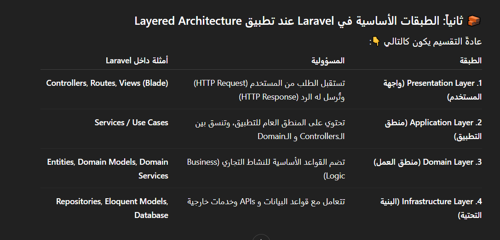
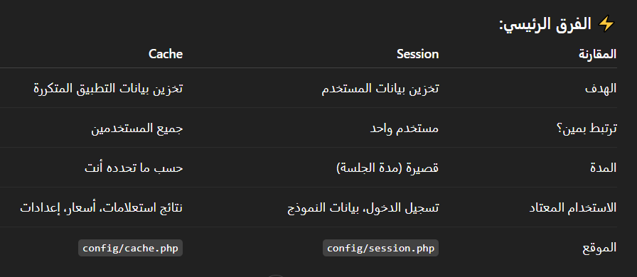
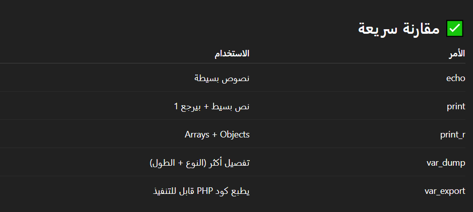
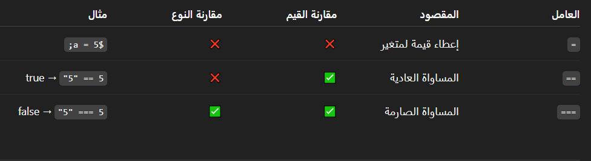

## ⚡ 1-  Types of relationships in a database:
### 1- One-to-One:
- مثال: كل User له Profile واحد فقط.
```php
// users table
Schema::create('users', function (Blueprint $table) {
    $table->id();
    $table->string('name');
    $table->timestamps();
});

// profiles table
Schema::create('profiles', function (Blueprint $table) {
    $table->id();
    $table->foreignId('user_id')->constrained()->onDelete('cascade');
    $table->string('bio')->nullable();
    $table->timestamps();
});

---------------------------------------

// In user.php
public function profile()
{
    return $this->hasOne(Profile::class);
}

// In profile.php
public function user()
{
    return $this->belongsTo(User::class);
}

```
### 2- One-to-Many:
- مثال: User يكتب Posts كثيرة.
```php
// users table
Schema::create('users', function (Blueprint $table) {
    $table->id();
    $table->string('name');
    $table->timestamps();
});

// posts table
Schema::create('posts', function (Blueprint $table) {
    $table->id();
    $table->string('title');
    $table->text('content');
    $table->foreignId('user_id')->constrained()->onDelete('cascade');
    $table->timestamps();
});

---------------------------------------

// In user.php
public function posts()
{
    return $this->hasMany(Post::class);
}

// In profile.php
public function user()
{
    return $this->belongsTo(User::class);
}
```
### 3- Many-to-Many:
- مثال: Students يدرسون في Courses، وكل Course له طلاب كُثر.

```php
// students table
Schema::create('students', function (Blueprint $table) {
    $table->id();
    $table->string('name');
    $table->timestamps();
});

// courses table
Schema::create('courses', function (Blueprint $table) {
    $table->id();
    $table->string('title');
    $table->timestamps();
});

// pivot table
Schema::create('course_student', function (Blueprint $table) {
    $table->id();
    $table->foreignId('student_id')->constrained()->onDelete('cascade');
    $table->foreignId('course_id')->constrained()->onDelete('cascade');
});

---------------------------------------

// In Student.php
public function courses()
{
    return $this->belongsToMany(Course::class);
}

// In Course.php
public function students()
{
    return $this->belongsToMany(Student::class);
}
```


## ⚡ 2- 

- ال belongsTo يتحط في الـ Model اللي بيحتوي على الـ foreign key.
- ال hasMany يتحط في الـ Model اللي بيتم الإشارة ليه بالـ foreign key.

## ⚡ 3-  Eager Loading
- في Laravel معناها إنك تجيب البيانات الأساسية مع البيانات المرتبطة بيها في نفس الاستعلام بدل ما تعمل استعلام لكل علاقة لوحدها.
- لأن في العادة، لو عندك موديل Cart مرتبط بموديل Product، وإنت جبت كل الـ carts كده:
```
$carts = Cart::all();
```
- في الحالة دي Laravel هيعمل:
- 1- استعلام أول يجيب كل الـ carts.
- 2- وبعدين استعلام لكل cart عشان يجيب الـ product الخاص بيه (دي مشكلة اسمها N+1 Problem).
- لو عندك 100 cart → هيعمل استعلام + 100 استعلام زيادة! 💥
> ✅ Eager Loading بتحل المشكلة دي إزاي؟
- بنستخدم with() بالشكل ده:
```
$carts = Cart::with('product')->get();
```
- ده بيعمل:
- 1- استعلام أول يجيب كل الـ carts.
- 2- واستعلام تاني واحد بس يجيب كل الـ products المرتبطة بيهم.
- يعني وفرنا استعلامات كتير وسرعنا الأداء.
> ✅ إيه المطلوب عشان تشتغل؟
- لازم في Cart model يكون عندك علاقة بالشكل ده:
```
public function product()
{
    return $this->belongsTo(Product::class);
}
```
## ⚡ 4-  Session
- هي آلية لتخزين البيانات بين الطلبات (HTTP Requests) بحيث تظل متاحة للمستخدم طوال فترة الجلسة.
```
Session::put('user_name', 'ahmed');
```
## ⚡ 5-  Middleware
- الـ Middleware هو طبقة وسيطة بين الطلب (Request) و الاستجابة (Response)، تُستخدم لتنفيذ منطق معين قبل أن يصل الطلب إلى Controller أو قبل أن يُرسل الرد إلى المستخدم.
```
class CheckAge
{
    public function handle(Request $request, Closure $next)
    {
        if ($request->age < 18) {
            return redirect('home');
        }
        return $next($request);
    }
}
```
- وبنسجله بقي في ال kernel.php
## ⚡ 6- Facade
- هو class static بيوفرلك طريقة سهلة إنك تستعمل الخدمات (services) أو الـ classes اللي في الـ Service Container من غير ما تحتاج تعمل new أو تعمل Dependency Injection.
- بدل ما تكتب:
```
use Illuminate\Support\Facades\App;

$app = App::make('cache');
$app->put('name', 'Rana', 22);
```
- تقدر تستخدم Facade كده:
```
Cache::put('name', 'Rana', 22);
```
## ⚡ 7- seeder -> ادخال بيانات
- هو وسيلة لإدخال بيانات تجريبية أو افتراضية داخل قاعدة البيانات بشكل تلقائي أثناء التطوير أو الاختبار.
## ⚡ 8- factory -> مولد بيانات
- تُستخدم لتوليد بيانات تجريبية (Dummy Data) بشكل تلقائي، وغالبًا يتم استخدامها مع Seeders أثناء التطوير أو الاختبار ومع الموديل.
## ⚡ 9- Resource Controllers
- هو طريقة سريعة وسهلة لإنشاء Controller يدعم كل العمليات الأساسية للـ CRUD (Create, Read, Update, Delete) بدون كتابة كل دالة يدوياً
```
php artisan make:controller PostController --resource
```
- في ملف routes/web.php:
```
Route::resource('posts', PostController::class);
```
## ⚡ 10-  Query Scopes
- هي طريقة لتعريف شروط جاهزة لإعادة استخدامها على استعلامات الـ Eloquent، بدل ما تكتب نفس الشرط في كل مرة
- ببساطة هي فلتر أو شرط جاهز نقدر نطبقه على الـ Model بسهولة
```
// Scope لإحضار البوستات بواسطة كاتب معين
    public function scopeByAuthor($query, $authorId)
    {
        return $query->where('author_id', $authorId);
    }
// الاستخدام
$authorPosts = Post::byAuthor(5)->get();
```
- لاحظ: الاسم يبدأ بـ scope، لكن عند الاستخدام نحذف scope ونكتب فقط ما بعدها (byAuthor).
## ⚡ 11-  Trait
- عبارة عن وسيلة لإعادة استخدام الكود بين الكلاسات
- بيشبه الـ "mixin" → يعني تقدر تكتب دوال (methods) في ملف واحد وتستخدمها في أي كلاس تاني عن طريق use.
- بيحل مشكلة multiple inheritance اللي مش موجودة في PHP.
```php
trait Logger {
    public function log($message) {
        echo "Log: $message";
    }
}

class User {
    use Logger;
}

class Product {
    use Logger;
}

$user = new User();
$user->log("User created");

$product = new Product();
$product->log("Product created");

```
## ⚡ 12-  Observer class
- هو كلاس بيراقب (observe) أحداث Eloquent Models
- بيوفرلك Events زي: creating, created, updating, updated, deleting, deleted, وهكذا
- الفكرة إنك تحط logic معين يتنفذ أوتوماتيك مع حصول أي حدث على الموديل
- مثلا لو عايز كل ما يتعمل create ليوزر جديد، يتبعت له إيميل ترحيب.
```
php artisan make:observer UserObserver --model=User
```
## ⚡ 13-  Eloquent ORM
- هو الـ Object Relational Mapper الافتراضي في Laravel.
- معناه ببساطة: بدل ما تكتب SQL Queries طويلة وصعبة، تقدر تتعامل مع قاعدة البيانات باستخدام كائنات (Objects) و Models في Laravel.
- هو طبقة وسيطة بتخلي التعامل مع الجداول كأنه تعامل مع كائنات PHP.
- EX:
- 📌 إضافة مستخدم جديد
```php
$user = new User();
$user->name = "Ahmed";
$user->email = "ahmed@example.com";
$user->password = bcrypt("123456");
$user->save();
```
- ممكن تستخدم Eloquent بطريقة مرنة زي الـ Query Builder:
```php
$users = User::where('active', 1)
             ->orderBy('created_at', 'desc')
             ->take(10)
             ->get();
```
## ⚡ 14-  SPA (Single Page Applications)
- يعني: تطبيق ويب بيشتغل كله من صفحة واحدة (index.html).
- بدل ما كل مرة المستخدم يفتح لينك يتعمل Reload كامل للصفحة → المتصفح بيحمّل جزء جديد (Component) بس، والباقي يفضل زي ما هو.
- الهدف منه: إن الصفحة كلها تفضل واحدة، والتنقل بيكون داخلي بالـ JavaScript من غير Reload كامل.
- الـ SPA هو موقع/تطبيق ويب تفاعلي بيشتغل كله من صفحة واحدة، بيفصل بين الـ Frontend (واجهة المستخدم) و الـ Backend (API)، وبيخلي التجربة شبه الموبايل أبلكيشن.
- Ex:
- مثل Gmail Web (اللي معمول بـ SPA) → تفتح Inbox وتدخل Email من غير ما الصفحة تعيد تحميل نفسها.
## ⚡ 15-  Schema
- وصف عام لكل الجداول والاعمده
- يصف هيكل الجداول والأعمدة والمفاتيح
- مثلا لو قىولنا ال Blog is schema يقصد هو ال هيبقي فيه كل حاجه هو الاساس ال هيوضح الجداول وكده
## ⚡ 16-  Guard
- تحديد طريقة مصادقة (Authentication) المستخدم.
- منين هنجيب بياناته (من أي Driver أو Provider).
- إزاي نتحقق إنه مسجّل دخول.
- الخلاصه هو بواب الحراسة اللي بيقول: "المستخدم ده دخل إزاي؟ ومنين هجيب بياناته؟"
- ### ال Guard و Provider
- Provider: بيحدد منين هنجيب بيانات المستخدم (مثلاً: من جدول users في قاعدة البيانات).
- Guard: بيستخدم الـ Provider ده علشان يعمل تسجيل دخول (login) أو يتحقق من المستخدم الحالي (check / attempt).
```
// جلب المستخدم الحالي:
$admin = Auth::guard('admin')->user();
```
## ⚡ 17-  Spatie package
- باكدج لل permissions مثلا لل admin و ال user ...
## ⚡ 18-  $fillable & $guarded
- $fillable : defines which fields are allowed for mass assignment (هيسمح إنك تضيف أو تحدّث البيانات لهذه الحقول فقط)
- $guarded : defines which fields are NOT allowed for mass assignment. (يمنع فقط الحقول اللي هنا، والباقي مسموح)

## ⚡ 19-  API Resource
- بدل ما ترجع البيانات كما هي من قاعدة البيانات، يمكنك التحكم في شكلها النهائي الذي سيراه المستخدم أو التطبيق.
- مثلا فيه بيانات مثل:
```php
{
  "id": 1,
  "name": "Phones",
  "slug": "phones",
  "status": 1,
  "created_at": "2025-10-07T12:00:00",
  "updated_at": "2025-10-07T12:30:00"
}

```
- لكن أنت مش عايز ترجع كل الحقول، فقط تريد (id, name, status)
- تستخدم الأمر التالي:
```php
php artisan make:resource CategoryResource
```
- افتح الملف وعدّله بهذا الشكل:
```php
class CategoryResource extends JsonResource
{
    public function toArray(Request $request): array
    {
        return [
            'id' => $this->id,
            'name' => $this->name,
            'status' => $this->status ? 'Active' : 'Archived',
        ];
    }
}

```
- في الـ Controller يمكنك استخدامه هكذا:
```php
class CategoriesController extends Controller
{
    public function index()
    {
        $categories = Category::all();
        return CategoryResource::collection($categories);
    }

    public function show($id)
    {
        $category = Category::findOrFail($id);
        return new CategoryResource($category);
    }
}

```
## ⚡ 20-
```php
php artisan storage:link
```
- هو بيعمل رابط رمزي (symbolic link) بين مجلد
  storage/app/public
  و
  public/storage
- يعني أي ملف ترفعه إلى storage/app/public، يقدر المستخدم يوصل له من خلال الرابط العام
## ⚡ 21- Repository and Service patterns
- نمط Repository يقوم بعزل منطق الوصول للبيانات بحيث لا تتعامل الـ Controllers أو الـ Services مباشرة مع قاعدة البيانات.
- نمط Service يحتوي على منطق الأعمال (Business Logic)، ليبقى الـ Controller نظيفًا وخفيفًا.

✅ فوائد هذا التصميم:

ال Controller: مسؤول فقط عن استقبال الطلبات والرد عليها.

ال Service: يحتوي على منطق الأعمال.

ال Repository: مسؤول عن الوصول للبيانات.

الكود يصبح سهل الصيانة، الاختبار، وقابل لتغيير التنفيذ بدون التأثير على بقية التطبيق.

## ⚡ 22- Layered Architecture


🧭 الفكرة ببساطة:

- ال Controller: يستقبل الطلب ويتعامل مع الـService.
- ال Service: ينسق المنطق بين الطبقات.
- ال Repository: يتعامل مع قاعدة البيانات.
- ال Entity: تمثل الكيان الحقيقي في النظام.
> العلاقات بين الطبقات اتجاه واحد فقط (من الأعلى للأسفل)، يعني الـController يعتمد على الـService، والـService يعتمد على الـRepository، لكن الـRepository ما يعرفش عن الـService أو الـController.

## ⚡ 23- Resource Controllers
- هي نوع خاص من الـControllers يوفر سبع دوال جاهزة للتعامل مع CRUD (إنشاء – قراءة – تحديث – حذف).
```
php artisan make:controller UserController --resource
```
- يحتوي على:
```php
public function index()   // عرض كل العناصر
public function create()  // عرض صفحة الإنشاء
public function store()   // حفظ عنصر جديد
public function show($id) // عرض عنصر واحد
public function edit($id) // عرض صفحة التعديل
public function update(Request $request, $id) // تحديث
public function destroy($id) // حذف
```
- في routes/web.php:
```
Route::resource('users', UserController::class);
```
## ⚡ 24- Soft Deletes
- بدل ما يتم مسح السجل من قاعدة البيانات نهائيًا، Laravel بيحط تاريخ الحذف في عمود deleted_at، وبكده يعتبر السجل محذوف ظاهريًا لكنه موجود فعلًا في قاعدة البيانات.
## ⚡ 25- explode & implode
- 1-ال explode : بتحول ال String الي Array
- 2-ال implode : بتحول ال Array الي String
## ⚡ 26- Tinker
- هو REPL (Read–Eval–Print Loop) مبني على PsySH مدمج مع Laravel. يخلّيك تكتب أوامر PHP وتنفذها فورًا داخل بيئة التطبيق (مع Models، Facades، والـ container). مفيد للتجارب السريعة، تعديل بيانات، اختبار كود، أو تنفيذ أوامر صغيرة بدون إنشاء ملفات مؤقتة.
- يعتبر ذي postman بس كونسول (حاجه سريعه كده)
```
php artisan tinker
```
- جرب اي حاجه بقي وفي الاخر exit
## ⚡ 27- Eloquent ORM و Query Builder
1- ال Eloquent ORM : هو نظام ORM مدمج في Laravel يسمح لك بالتعامل مع قاعدة البيانات باستخدام الكائنات (Objects) بدلًا من كتابة SQL بشكل مباشر.
- يعني كل جدول في قاعدة البيانات بيكون له Model يمثل البيانات فيه، وكل صف (Row) بيكون كائن (Object) من هذا الموديل.
- يعني دي بتكون مع الموديل USER
```
// استرجاع كل المستخدمين
$users = User::all();

// استرجاع مستخدم معين
$user = User::find(1);

// إضافة مستخدم جديد
$user = new User();
$user->name = 'Ahmed';
$user->email = 'ahmed@example.com';
$user->save();
```
2- ال Query Builder : هو أداة تانية في Laravel تتيح لك كتابة استعلامات SQL باستخدام PHP، لكن بدون التعامل مع الموديلات أو الكائنات.
- دي بتكون مع ال tables يعني DB::table('users')
```
// استرجاع كل المستخدمين
$users = DB::table('users')->get();

// استرجاع مستخدم معين
$user = DB::table('users')->where('id', 1)->first();

// إضافة مستخدم جديد
DB::table('users')->insert([
    'name' => 'Ahmed',
    'email' => 'ahmed@example.com'
]);
```
## ⚡ 28- Fortify package
- باكدج كويسه لما يكون عندي users and admins
- نظام المصادقة (Authentication)
## ⚡ 29- Cache & Session

- مثال: في تطبيق تحويل عملات:
- ال Session: ممكن تخزن فيها آخر عملة اختارها المستخدم
- ال Cache: ممكن تخزن فيها سعر الدولار مقابل الجنيه لمدة 24 ساعة لتقليل استعلامات الـ API.
## ⚡ 30- Jobs & Queues
- ال Jobs معناها “مهمة” أو “عمل” بيتم تنفيذه في الخلفية (Background).
- وده مفيد جدًا لما يكون عندك عملية بتاخد وقت طويل (زي إرسال إيميلات، رفع ملفات، معالجة صور...).
- بدل ما المستخدم يستنى العملية دي تخلص، Laravel بيخليها تشتغل في الخلفية باستخدام الـ Queue.
- الـ Queue (الطابور) هو نظام بيخزن المهام (jobs) و ينفذها واحدة ورا التانية بدون ما يبطّئ التطبيق.

## ⚡ 31- Print...


## ⚡ 32- (=, ==, ===)

- (=) -> set value
- (==) -> check the value
- (===) -> check the value and data type

## ⚡ 33- Filament
- دي Package / Framework جاهزة بوجودها بتساعدك تعمل لوحة تحكم (Admin Panel) قوية وسريعة من غير ما تكتب كود كتير.
- عبارة عن لوحة تحكم جاهزة مبنية على Laravel و Tailwind،
- الخطوات :
```php
1- composer require filament/filament:"^4.0"
```
```php
2- php artisan filament:install --panels
```
```php
3- php artisan make:filament-user
لو عامله seeder مثلا مش لازم دا
```
```php
4- php artisan vendor:publish --tag=filament-config
```
```php
5- php artisan make:filament-resource ModelName --generate
```
#### filament custom page (seeting page for ex)
```php
1- php artisan make:filament-page Settings
```
-ده هيعمل:

1- كلاس للصفحة في:
app/Filament/Pages/SettingsPage.php

2- فيو للصفحة في:
resources/views/filament/pages/settings-page.blade.php

- [READ-DOCS](https://filamentphp.com/docs/4.x/introduction/installation)

## ⚡ 34- Transaction
- هي طريقة تضمن إن مجموعة استعلامات على قاعدة البيانات تتم بشكل كامل أو لا تتم نهائيًا.
- بتستخدمها لما يكون عندك أكتر من خطوة مرتبطة ببعض
- كل العمليات تنجح مع بعض أو تفشل مع بعض.
- مثال: عملية دفع :
```php
use Illuminate\Support\Facades\DB;

public function pay(Request $request)
{
    $userId = auth()->id();
    $amount = 500;

    DB::transaction(function () use ($userId, $amount) {

        // 1️⃣ تسجيل الدفع
        $payment = Payment::create([
            'user_id' => $userId,
            'amount'  => $amount,
            'status'  => 'success',
        ]);

        // 2️⃣ تحديث الطلب ليصبح مدفوع
        Order::where('user_id', $userId)
            ->where('status', 'pending')
            ->update(['status' => 'paid']);

    });

    return response()->json(['message' => 'Payment successful']);
}
```
تسجيل الفلوس اتدفعت ✅

تحديث حالة الطلب ✅

لو واحدة نجحت والتانية فشلت → مينفعش
عشان كده لازم ينجحوا مع بعض أو يفشلوا مع بعض.
## ⚡ 35- Create user in Tinker
1-
```php
php artisan tinker
```
2-
```php
$user = User::create([
    'name' => 'Test User',
    'email' => 'phone@test.com',
    'phone' => '01012345678',
    'password' => bcrypt('password123'),
]);
```
3-
```php
$token = $user->createToken('postman')->plainTextToken;
$token  
```

